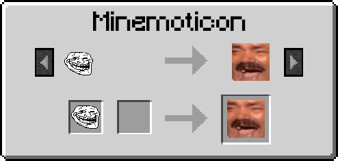

# Minemoticon

<!--

-->

Emoji support for `1.7.10 Minecraft`. Custom packs, server packs, emoji picker, autocomplete, multiplayer sharing.

[](https://github.com/JackOfNoneTrades/minemoticon/releases)
[](https://maven.fentanylsolutions.org/#/releases/org/fentanylsolutions/minemoticon)

[](https://discord.gg/xAWCqGrguG)

<!--
[](https://modrinth.com/mod/minemoticon)
[](https://www.curseforge.com/minecraft/mc-mods/minemoticon)
[](https://www.mcmod.cn/class/TODO.html)
-->

<!--


-->

### Features

* **Stock emojis** from [Twemoji]().
* **Custom emoji packs** from local folders. Drop PNGs, JPGs, QOI, or WebP files into `config/minemoticon/packs/<packname>/`. Supports `pack.meta` for display names and icons.
* **Server emoji packs** synced to clients on join. Add pack folders in `config/minemoticon/server_packs/`. Use `/reload_emojis` to reload packs on a live server.
* **Multiplayer emote sharing**. If enabled, the server proxies user client emojis to other clients. Clients can refuse third party emojis.
* **Emoji picker** in chat with categories/packs and search.
* **Autocomplete suggestions** when typing `:emo...`.
* **Unicode emoji input**. Paste `☃️` and it renders as Twemoji. Also supports `:colon:` syntax.
* **Namespaced pack emojis** (`:pack_folder_name/emoji:`) to avoid collisions with stock emojis.
* **Custom emoji font support (experimental)**. Drop TTF files into `config/minemoticon/fonts/`. Supports COLRv0 (color layers), CBDT (bitmap), and monochrome outlines.
* **Emojis should works everywhere**: chat, signs, config GUIs, books.

### Config

All config lives under `config/minemoticon/`:

| File/Folder | Purpose                                                                   |
|---|---------------------------------------------------------------------------|
| `minemoticon.cfg` | Client settings (twemoji toggle, picker behavior, font, debug)            |
| `server.cfg` | Server settings (client emotes, max size). Synced to clients via GTNHLib. |
| `packs/` | Client emoji packs (subfolders with images + optional `pack.meta`)        |
| `server_packs/` | Server emoji packs (same format, synced to clients on join)               |
| `fonts/` | User TTF emoji fonts                                                      |
| `cache/` | Atlas spritesheets (managed by the mod)                                   |
| `emote_cache/` | Remote emote images (cleared on disconnect)                               |

**pack.meta** example:
```json
{
  "name": "My Emoji Pack",
  "icon": "trollface"
}
```

### Commands

| Command | Permission | Description |
|---|---|---|
| `/reload_emojis` | OP | Rescan server packs and resync all clients |

## Dependencies

* [UniMixins](https://modrinth.com/mod/unimixins) [](https://www.curseforge.com/minecraft/mc-mods/unimixins) [](https://modrinth.com/mod/unimixins) [](https://github.com/LegacyModdingMC/UniMixins/releases)
* [GTNHLib](https://github.com/GTNewHorizons/GTNHLib)
* [FentLib](https://maven.fentanylsolutions.org/#/releases/org/fentanylsolutions/fentlib)

## Building & Developer info

`./gradlew build`

To update the bundled emoji data and font:
```sh
./update-emoji-data.sh
```

## Credits

* [Twemoji](https://github.com/twitter/twemoji) for emoji assets.
* [iamcal/emoji-data](https://github.com/iamcal/emoji-data) for emoji metadata.
* [GT:NH buildscript](https://github.com/GTNewHorizons/ExampleMod1.7.10).

## License

[LGPLv3 + SNEED](LICENSE)

## Buy me a coffee

* [ko-fi.com](https://ko-fi.com/jackisasubtlejoke)
* Monero: `893tQ56jWt7czBsqAGPq8J5BDnYVCg2tvKpvwTcMY1LS79iDabopdxoUzNLEZtRTH4ewAcKLJ4DM4V41fvrJGHgeKArxwmJ`

<br>


