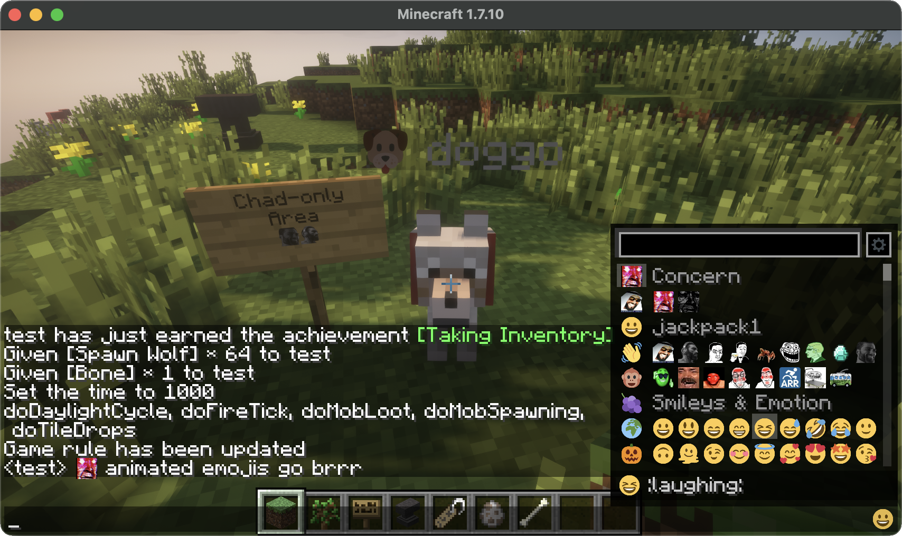

# Minemoticon


Emoji and font support for `1.7.10 Minecraft`. Custom packs, server packs, animated custom emojis, picker, autocomplete, multiplayer sharing, and emoji fonts.
This mod bundles the [FreeType](https://freetype.org/) library for font rendering. The default emoji font uses [Twemoji](https://github.com/twitter/twemoji).

[](https://github.com/JackOfNoneTrades/minemoticon/releases)
[](https://www.curseforge.com/minecraft/mc-mods/minemoticon)
[](https://67.fentanylsolutions.org/mod/minemoticon)
[](https://maven.fentanylsolutions.org/#/releases/org/fentanylsolutions/minemoticon)

[](https://discord.gg/xAWCqGrguG)

<!--
[](https://modrinth.com/mod/minemoticon)
[](https://www.mcmod.cn/class/TODO.html)
-->



### Features

* Unicode and custom emoji support. Should work in all GUIs and on all in-game surfaces.
* Support for custom emoji sync on servers which also have the mod installed.
* Emoji picker and autocomplete.
* Custom font support. Load any ttf or otf file. Fallback support.

### Commands

| Command | Permission | Description |
|---|---|---|
| `/reload_emojis` | OP | Rescan server packs and resync all clients |
| `/clear_emojis [player]` | OP | Clear all persistent custom emojis, or only one player's |

## Dependencies

* [UniMixins](https://modrinth.com/mod/unimixins) [](https://www.curseforge.com/minecraft/mc-mods/unimixins)  [](https://modrinth.com/mod/unimixins/versions) [](https://github.com/LegacyModdingMC/UniMixins/releases)
* [GTNHLib](https://modrinth.com/mod/gtnhlib)   [](https://www.curseforge.com/minecraft/mc-mods/gtnhlib)  [](https://modrinth.com/mod/gtnhlib) [](https://github.com/GTNewHorizons/GTNHLib/releases)
* [FentLib](https://www.curseforge.com/minecraft/mc-mods/fentlib) [](https://www.curseforge.com/minecraft/mc-mods/fentlib) [](https://modrinth.com/mod/fentlib) [](https://67.fentanylsolutions.org/mod/fentlib) [](https://github.com/JackOfNoneTrades/FentLib)

## Building

`./gradlew build`

Native FreeType support is built automatically as part of `build`, leveraging the zig compiler.

If you cloned without submodules, initialize FreeType first:
```sh
git submodule update --init --checkout
```

FreeType and Zig versions are configured in `dependencies.gradle`.
After changing `freetypeVersion`, run:
```sh
./gradlew syncFreetypeSubmodule
```

To update the bundled emoji data and font:
```sh
./update-emoji-data.sh
```

## Credits

* [Twemoji](https://github.com/twitter/twemoji) for default emoji assets.
* [iamcal/emoji-data](https://github.com/iamcal/emoji-data) for emoji metadata.
* [FreeType](https://freetype.org/).
* [GT:NH buildscript](https://github.com/GTNewHorizons/ExampleMod1.7.10).

## License

`LGPLv3`.

## Buy me a coffee

* [ko-fi.com](https://ko-fi.com/jackisasubtlejoke)
* Monero: `893tQ56jWt7czBsqAGPq8J5BDnYVCg2tvKpvwTcMY1LS79iDabopdxoUzNLEZtRTH4ewAcKLJ4DM4V41fvrJGHgeKArxwmJ`

<br>


